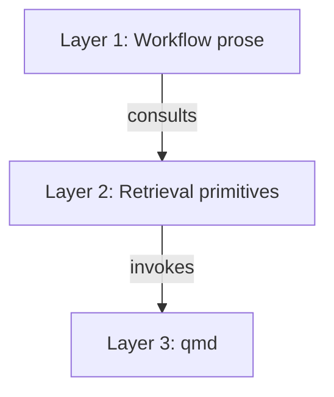

# Mermaid Diagrams Convention Implementation Plan

> **For agentic workers:** REQUIRED SUB-SKILL: Use superpowers:subagent-driven-development (recommended) or superpowers:executing-plans to implement this plan task-by-task. Steps use checkbox (`- [ ]`) syntax for tracking.

**Goal:** Add a `## Diagrams` section to the vault `CLAUDE.md` template inside `RUNBOOK.md` so produced vaults prefer ` ```mermaid ` blocks over hand-drawn ASCII art, with ASCII allowed only as escape hatch.

**Architecture:** Single insertion into `RUNBOOK.md` at one location: inside the vault `CLAUDE.md` template (Phase 5, Task 5.1), immediately after the existing `## Wikilinks` section (currently lines 1482–1495), before the `## Retrieval scopes` heading (currently line 1497). Verification is grep-based — there is no executable code or test runner involved.

**Tech Stack:** Markdown, `grep`, `git`. No new dependencies.

**Spec:** [`docs/superpowers/specs/2026-05-10-mermaid-diagrams-design.md`](../specs/2026-05-10-mermaid-diagrams-design.md).

---

## File Structure

**Modified files:**
- `RUNBOOK.md` — single insertion inside the vault `CLAUDE.md` template (Phase 5, Task 5.1, currently between line 1495 and line 1497).

**No new files.** No skill, plugin, or vendor changes. The vault `CLAUDE.md` template is the only surface that needs the rule (see spec §3).

---

### Task 1: Insert the `## Diagrams` section into the vault `CLAUDE.md` template

**Files:**
- Modify: `RUNBOOK.md` — vault `CLAUDE.md` template, between current lines 1495 and 1497.

- [ ] **Step 1: Verify the insertion anchor is still where the spec expects**

The anchor is the last line of the existing `## Wikilinks` block. Confirm it appears exactly once and at the expected location.

Run:

```bash
grep -n 'Use \[label\](https://...) for external links\.' RUNBOOK.md
```

Expected output (single line, line number may have drifted slightly if the runbook was edited; the important thing is exactly one match):

```
1495:Use [label](https://...) for external links.
```

If you see zero matches or more than one, STOP and reconcile with the spec — the insertion anchor has changed.

- [ ] **Step 2: Confirm no `## Diagrams` heading exists yet**

Run:

```bash
grep -cn '^## Diagrams' RUNBOOK.md
```

Expected output:

```
0
```

If non-zero, STOP — a Diagrams section already exists and must be reviewed before re-adding.

- [ ] **Step 3: Make the edit**

Use the Edit tool to insert the new section. The vault `CLAUDE.md` template in `RUNBOOK.md` is wrapped in a 4-backtick `` ````markdown `` outer fence (look at line 1424 for context), so the inserted block can use ordinary 3-backtick fences without escaping.

Edit `RUNBOOK.md`:

`old_string`:

````
Use [label](https://...) for external links.

## Retrieval scopes
````

`new_string`:

````
Use [label](https://...) for external links.

## Diagrams

For diagrams — flowcharts, sequence, state, ER, class — prefer ```mermaid
blocks. Fall back to ASCII or Unicode line-drawing only when mermaid can't
express the structure. Mermaid renders natively in Obsidian preview and on
GitHub, stays diff-friendly, and remains editable by both humans and agents.

Code blocks holding literal text — directory trees, command transcripts,
sample frontmatter, file layouts — are not diagrams; leave those as plain
code blocks.

Example:



## Retrieval scopes
````

**Notes for the engineer:**
- The em-dashes (—) in the new content match the runbook's existing punctuation style — do not replace them with hyphens.
- The triple-backticks inside the new content are intentional. They sit inside the runbook's 4-backtick `` ````markdown `` outer fence (which begins at line 1424 and ends at line 1605, after the section we're inserting into) and therefore do not terminate it.
- The blank line before `## Diagrams` and before `## Retrieval scopes` is required for proper Markdown heading separation.

- [ ] **Step 4: Verify the new section is present, exactly once, and in the right place**

Run all three checks:

```bash
grep -cn '^## Diagrams' RUNBOOK.md
```

Expected:

```
1
```

```bash
grep -n '^## Wikilinks\|^## Diagrams\|^## Retrieval scopes' RUNBOOK.md
```

Expected (line numbers will have shifted by ~20 lines from the original; the *order* and the gap between Wikilinks and Diagrams matter):

```
1482:## Wikilinks
NNNN:## Diagrams
NNNN:## Retrieval scopes
```

— where the three line numbers are strictly increasing and no other heading sits between them.

```bash
grep -n 'flowchart TD' RUNBOOK.md
```

Expected (single match anywhere inside the vault `CLAUDE.md` template region, line number ~1500–1520):

```
NNNN:flowchart TD
```

- [ ] **Step 5: Confirm the runbook's outer 4-backtick fence still closes properly**

The vault `CLAUDE.md` template is wrapped in `` ````markdown `` … `` ```` ``. Adding 3-backtick fences inside should not affect this. Verify by listing every 4-backtick fence line and checking that openings and closings still balance.

Run:

```bash
grep -nE '^````markdown$|^````$' RUNBOOK.md
```

Expected output: every `` ````markdown `` line is paired with a later `` ```` `` line. The pair we care about — the one wrapping Task 5.1's vault `CLAUDE.md` template — has its opener at the line that originally was 1424 and its closer further down (originally line 1626; now ~1646 after this insertion adds ~20 lines).

If the count of `` ````markdown `` openings does not equal the count of `` ```` `` closings, STOP — the edit broke a fence and must be redone.

- [ ] **Step 6: Commit**

```bash
git add RUNBOOK.md
git commit -m "$(cat <<'EOF'
docs: add mermaid diagrams convention to vault CLAUDE.md template

Adds a Diagrams section to the vault CLAUDE.md template in RUNBOOK.md
(Phase 5, Task 5.1) that tells produced vaults to prefer ```mermaid
blocks over hand-drawn ASCII art, with ASCII as escape hatch.

Spec: docs/superpowers/specs/2026-05-10-mermaid-diagrams-design.md
EOF
)"
```

Then verify:

```bash
git log -1 --stat
```

Expected: one file changed, ~20 insertions, 0 deletions, on `RUNBOOK.md`.

---

## Self-review notes

- **Spec coverage:** Spec §1 (problem), §2 (goals), §3 (approach), §4.1 (location), §4.2 (literal text), §5 (compatibility), §7 (out-of-scope) are all single-shot covered by Task 1. Spec §6 (verification) maps to Task 1 Steps 4–5. The deferred verification in spec §6 step 3 (a fresh vault instantiation against the updated runbook) is intentionally not part of this plan — it requires running the full Phase 0–7 sequence and is out of scope for a documentation-only change.
- **No placeholders:** All steps contain actual commands, expected output, or literal content.
- **Type/identifier consistency:** Heading is `## Diagrams` everywhere (steps 2, 3, 4). Anchor line `Use [label](https://...) for external links.` is identical in steps 1 and 3. Mermaid example token `flowchart TD` appears identically in steps 3 and 4.
